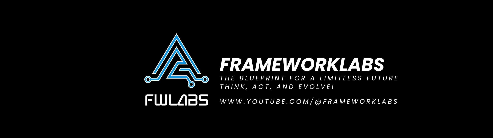
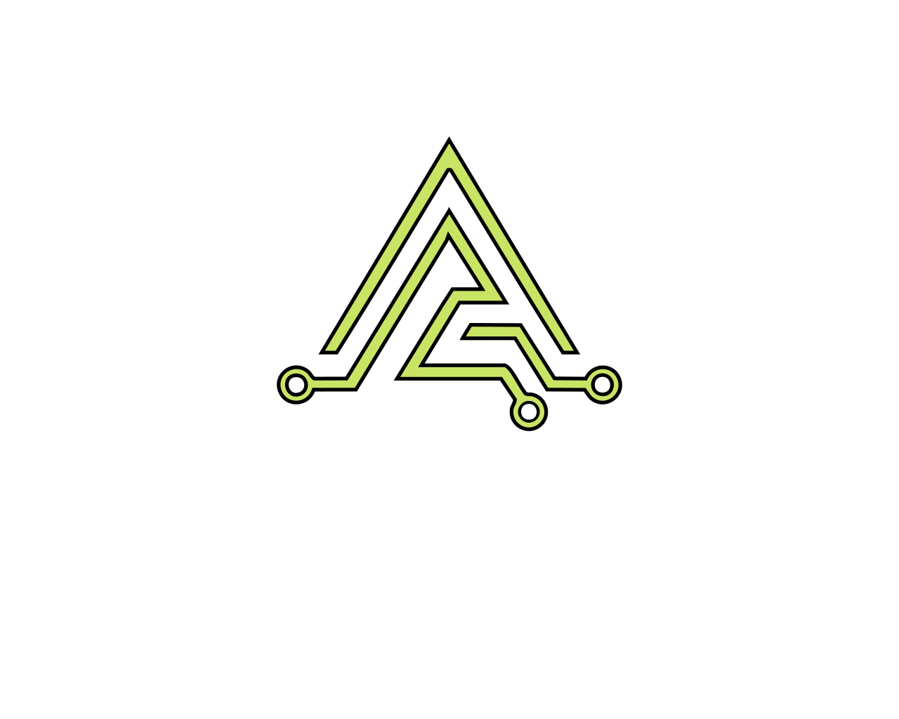

# Hello! I'm Wesam Abousaid 👋

**Software Engineer** | **AI Engineer** based in **Madrid, Spain** specializing in **Product & Platform Engineering**, **Distributed Systems (AWS)**, and **AI‑Enabled Systems**.

I build scalable, production‑grade platforms across **E‑Commerce, PropTech, SaaS/CRM, and Cloud‑Native ecosystems**. My primary stack includes **Node.js** and **TypeScript**, with strong experience in **Java (Spring Boot)**.

My work focuses on designing distributed, integration‑heavy systems and data workflows that tie architecture decisions directly to business outcomes. This includes launching greenfield products, scaling high‑traffic platforms, and modernizing monoliths into resilient microservices.

  - 🔭 **Currently:** Senior Software Engineer at Huspy
  - 🌱 **Exploring:** LLM-powered workflow orchestration & planner–executor architectures in distributed systems
  - 💬 **Ask me about:** System Design, Meta‑Cognitive Engineering, Platform Architecture
  - 🤝 **Pronouns:** He / Him
  - 😄 **Fun fact:** Some people read thrillers; I read psychology and behavioral economics
  
  ## 📫 Connect with me
  
    &nbsp;   &nbsp; 
  
  ## 🛠️ Technologies
  
  **Languages & Frameworks** 
  
  
  
  
  
  
  
  **Databases** 
  
  
  
  
  
  
  **Cloud & Infrastructure** 
  <img height="28" alt="AWS" src="https://img.shields.io/badge/AWS-232F3E?style=flat-square&logo=data%3Aimage%2Fsvg%2Bxml%3Bbase64%2CPHN2ZyBmaWxsPSIjZmZmZmZmIiBmaWxsLXJ1bGU9ImV2ZW5vZGQiIGhlaWdodD0iMWVtIiBzdHlsZT0iZmxleDpub25lO2xpbmUtaGVpZ2h0OjEiIHZpZXdCb3g9IjAgMCAyNCAyNCIgd2lkdGg9IjFlbSIgeG1sbnM9Imh0dHA6Ly93d3cudzMub3JnLzIwMDAvc3ZnIj48dGl0bGU%2BQVdTPC90aXRsZT48cGF0aCBkPSJNNi43NjMgMTEuMjEyYzAgLjI5Ni4wMzIuNTM1LjA4OC43MS4wNjQuMTc2LjE0NC4zNjguMjU2LjU3Ni4wNC4wNjMuMDU2LjEyNy4wNTYuMTgzIDAgLjA4LS4wNDguMTYtLjE1Mi4yNGwtLjUwMy4zMzVhLjM4My4zODMgMCAwMS0uMjA4LjA3MmMtLjA4IDAtLjE2LS4wNC0uMjM5LS4xMTJhMi40NyAyLjQ3IDAgMDEtLjI4Ny0uMzc1IDYuMTggNi4xOCAwIDAxLS4yNDgtLjQ3MWMtLjYyMi43MzQtMS40MDUgMS4xMDEtMi4zNDcgMS4xMDEtLjY3IDAtMS4yMDUtLjE5MS0xLjU5Ni0uNTc0LS4zOS0uMzg0LS41OS0uODk0LS41OS0xLjUzMyAwLS42NzguMjQtMS4yMy43MjYtMS42NDQuNDg3LS40MTUgMS4xMzMtLjYyMyAxLjk1NS0uNjIzLjI3MiAwIC41NTEuMDI0Ljg0Ni4wNjQuMjk2LjA0LjYuMTA0LjkxOC4xNzZ2LS41ODNjMC0uNjA3LS4xMjctMS4wMy0uMzc1LTEuMjc3LS4yNTUtLjI0OC0uNjg2LS4zNjctMS4zLS4zNjctLjI4IDAtLjU2OC4wMzEtLjg2My4xMDMtLjI5NS4wNzItLjU4My4xNi0uODYyLjI3Mi0uMDkuMDQtLjE4NC4wNzUtLjI4LjEwNGEuNDg4LjQ4OCAwIDAxLS4xMjcuMDIzYy0uMTEyIDAtLjE2OC0uMDgtLjE2OC0uMjQ3di0uMzkxYzAtLjEyOC4wMTYtLjIyNC4wNTYtLjI4YS41OTcuNTk3IDAgMDEuMjI0LS4xNjcgNC41NzcgNC41NzcgMCAwMTEuMDA1LS4zNiA0Ljg0IDQuODQgMCAwMTEuMjQ2LS4xNTFjLjk1IDAgMS42NDQuMjE2IDIuMDkxLjY0Ny40NC40My42NjIgMS4wODUuNjYyIDEuOTYzdjIuNTg2aC4wMTZ6bS0zLjI0IDEuMjE0Yy4yNjMgMCAuNTM0LS4wNDguODIyLS4xNDRhMS43OCAxLjc4IDAgMDAuNzU4LS41MSAxLjI3IDEuMjcgMCAwMC4yNzItLjUxMmMuMDQ3LS4xOTEuMDgtLjQyMy4wOC0uNjk0di0uMzM1YTYuNjYgNi42NiAwIDAwLS43MzUtLjEzNiA2LjAyIDYuMDIgMCAwMC0uNzUtLjA0OGMtLjUzNSAwLS45MjYuMTA0LTEuMTkuMzItLjI2My4yMTUtLjM5LjUxOC0uMzkuOTE3IDAgLjM3NS4wOTUuNjU1LjI5NS44NDYuMTkxLjIuNDcuMjk2LjgzOC4yOTZ6bTYuNDEuODYyYy0uMTQ0IDAtLjI0LS4wMjQtLjMwNC0uMDgtLjA2NC0uMDQ4LS4xMi0uMTYtLjE2OC0uMzExTDcuNTg2IDYuNzI2YTEuMzk4IDEuMzk4IDAgMDEtLjA3Mi0uMzJjMC0uMTI4LjA2NC0uMi4xOTEtLjJoLjc4M2MuMTUxIDAgLjI1NS4wMjUuMzEuMDguMDY1LjA0OC4xMTMuMTYuMTYuMzEybDEuMzQyIDUuMjg0IDEuMjQ1LTUuMjg0Yy4wNC0uMTYuMDg4LS4yNjQuMTUxLS4zMTJhLjU0OS41NDkgMCAwMS4zMi0uMDhoLjYzOGMuMTUyIDAgLjI1Ni4wMjUuMzIuMDguMDYzLjA0OC4xMi4xNi4xNTEuMzEybDEuMjYxIDUuMzQ4IDEuMzgxLTUuMzQ4Yy4wNDgtLjE2LjEwNC0uMjY0LjE2LS4zMTJhLjUyLjUyIDAgMDEuMzExLS4wOGguNzQzYy4xMjcgMCAuMi4wNjUuMi4yIDAgLjA0LS4wMDkuMDgtLjAxNy4xMjhhMS4xMzcgMS4xMzcgMCAwMS0uMDU2LjJsLTEuOTIzIDYuMTdjLS4wNDguMTYtLjEwNC4yNjMtLjE2OC4zMTFhLjUxLjUxIDAgMDEtLjMwMy4wOGgtLjY4N2MtLjE1IDAtLjI1NS0uMDI0LS4zMi0uMDgtLjA2My0uMDU2LS4xMTktLjE2LS4xNS0uMzJMMTIuMzIgNy43NDdsLTEuMjMgNS4xNGMtLjA0LjE2LS4wODcuMjY0LS4xNS4zMi0uMDY1LjA1Ni0uMTc3LjA4LS4zMi4wOGgtLjY4Ni4wMDF6bTEwLjI1Ni4yMTVjLS40MTUgMC0uODMtLjA0OC0xLjIyOS0uMTQzLS4zOTktLjA5Ni0uNzEtLjItLjkxOC0uMzItLjEyOC0uMDcxLS4yMTUtLjE1MS0uMjQ3LS4yMjNhLjU2My41NjMgMCAwMS0uMDQ4LS4yMjR2LS40MDdjMC0uMTY3LjA2NC0uMjQ3LjE4My0uMjQ3LjA0OCAwIC4wOTYuMDA4LjE0NC4wMjQuMDQ4LjAxNi4xMi4wNDguMi4wOC4yNzEuMTIuNTY2LjIxNS44NzguMjc5LjMyLjA2NC42My4wOTYuOTUuMDk2LjUwMiAwIC44OTQtLjA4OCAxLjE2NS0uMjY0YS44Ni44NiAwIDAwLjQxNS0uNzU4Ljc3Ny43NzcgMCAwMC0uMjE1LS41NTljLS4xNDQtLjE1MS0uNDE2LS4yODctLjgwNy0uNDE1bC0xLjE1Ny0uMzZjLS41ODMtLjE4My0xLjAxNC0uNDU0LTEuMjc3LS44MTNhMS45MDIgMS45MDIgMCAwMS0uNC0xLjE1OGMwLS4zMzUuMDczLS42My4yMTYtLjg4Ni4xNDQtLjI1NS4zMzUtLjQ3OS41NzUtLjY1NC4yNC0uMTg0LjUxLS4zMi44My0uNDE1LjMyLS4wOTYuNjU1LS4xMzYgMS4wMDYtLjEzNi4xNzUgMCAuMzYuMDA4LjUzNS4wMzIuMTgzLjAyNC4zNS4wNTYuNTE4LjA4OC4xNi4wNC4zMTIuMDguNDU1LjEyNy4xNDQuMDQ4LjI1Ni4wOTYuMzM2LjE0NGEuNjkuNjkgMCAwMS4yNC4yLjQzLjQzIDAgMDEuMDcxLjI2M3YuMzc1YzAgLjE2OC0uMDY0LjI1Ni0uMTg0LjI1NmEuODMuODMgMCAwMS0uMzAzLS4wOTYgMy42NTIgMy42NTIgMCAwMC0xLjUzMi0uMzExYy0uNDU1IDAtLjgxNS4wNzEtMS4wNjIuMjIzLS4yNDguMTUyLS4zNzUuMzgzLS4zNzUuNzEgMCAuMjI0LjA4LjQxNi4yNC41NjcuMTYuMTUyLjQ1NC4zMDQuODc3LjQ0bDEuMTM0LjM1OGMuNTc0LjE4NC45OS40NCAxLjIzNy43NjcuMjQ3LjMyNy4zNjcuNzAyLjM2NyAxLjExNyAwIC4zNDMtLjA3Mi42NTUtLjIwNy45MjZhMi4xNTcgMi4xNTcgMCAwMS0uNTgzLjcwM2MtLjI0OC4yLS41NDMuMzQzLS44ODYuNDQ3LS4zNi4xMTEtLjczNC4xNjctMS4xNDIuMTY3eiI%2BPC9wYXRoPjxwYXRoIGQ9Ik0uMzc4IDE1LjQ3NWMzLjM4NCAxLjk2MyA3LjU2IDMuMTUzIDExLjg3NyAzLjE1MyAyLjkxNCAwIDYuMTE0LS42MDcgOS4wNi0xLjg1Mi40NC0uMi44MTQuMjg3LjM4My42MDctMi42MjYgMS45NC02LjQ0MiAyLjk2OS05LjcyMiAyLjk2OS00LjU5OCAwLTguNzQtMS43LTExLjg3LTQuNTI2LS4yNDctLjIyMy0uMDI0LS41MjcuMjcyLS4zNTF6bTIzLjUzMS0uMmMuMjg3LjM2LS4wOCAyLjgyNi0xLjQ4NSA0LjAwNy0uMjE1LjE4NC0uNDIzLjA4OC0uMzI3LS4xNTFsLjE3NS0uNDM5Yy4zNDMtLjg4LjgwMi0yLjE5OC41Mi0yLjU1NS0uMzM2LS40My0yLjIyLS4yMDctMy4wNzQtLjEwMy0uMjU1LjAzMi0uMjk1LS4xOTItLjA2My0uMzYgMS41LTEuMDUzIDMuOTY3LS43NSA0LjI1NC0uMzk5eiI%2BPC9wYXRoPjwvc3ZnPg%3D%3D" />
  
  
  
  
  
  

  **AI &amp; Agentic Engineering** 
  
  
  
  
  
  
  
  
  

  ## 💻 Contributions

  **Claude‑Code‑Everything‑You‑Need‑to‑Know** the ultimate all‑in‑one guide to mastering Claude Code

  

    
  

  - 📈 **Rapid Growth:** ⭐ One of the most starred community guides for Claude Code on GitHub
  - 🔄 **Actively Maintained:** Regular updates with latest Claude Code features (2026)
  - 🌍 **Community Impact:** Used globally for mastering AI‑assisted coding
  - 📚 **Comprehensive Coverage:** From basics to advanced workflows (MCP, hooks, agent teams)

  [Master Claude Code →](https://github.com/wesammustafa/Claude-Code-Everything-You-Need-to-Know)

  **OpenCode‑Everything‑You‑Need‑to‑Know** - The comprehensive guide to open‑source AI coding

  

    
  

  - 🆓 **Open‑source & vendor freedom:** No lock‑in, use any AI model (OpenAI, Anthropic, DeepSeek, etc.)
  - ⌨️ **Terminal‑first workflow:** Designed for developers who live in the terminal
  - 🔧 **Extensible architecture:** Create custom skills, agents, and workflows
  - 🤝 **Active community:** Growing ecosystem with Discord support and comprehensive docs

  [Break free from vendor lock‑in →](https://github.com/wesammustafa/OpenCode-Everything-You-Need-to-Know)

  ## 🎙️ My Content

  - **Beyond Tech Podcast** – Bridging **cognitive science** and **software engineering** through **meta‑engineering**.  
    Each episode explores frameworks like **Strategic Learning Engineering**, **Metacognitive Debugging**, and **Cognitive Architecture Design** to optimize how engineers think and work.  
    [Listen & rewire your engineering mind →](https://www.youtube.com/playlist?list=PLK8BhQ11gUgsKMA1PASwMIOOMOZlxozcD)
 
   

     
     
   

  ---
  
  

  
  *Thanks for visiting my profile! Feel free to connect with me on any of the platforms above.*
  
  

